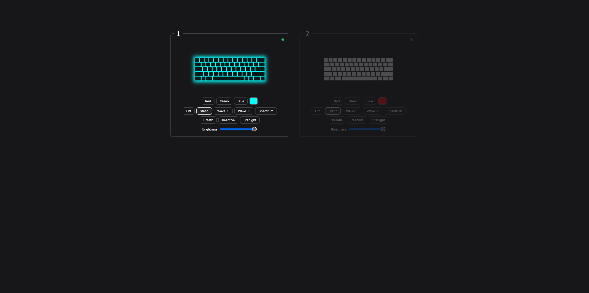

# Keyboard

A small web-based controller for Razer keyboards.

The project uses WebSockets to connect a web interface to keyboard clients running locally on supported machines.



## Structure

```text
apps/
├── macos/      # macOS keyboard client
├── server/     # WebSocket server
└── web/        # Web interface
```

### macOS

The macOS client connects to the server and controls the keyboard using [`librazermacos`](https://github.com/1kc/librazermacos).

It handles keyboard state, color, effects, brightness, and diagnostics.

The current state is stored locally so it can be restored after restarting the machine.

### Server

The server handles WebSocket connections between keyboard and web clients.

Keyboard client authenticate using a per-keyboard token.

### Web

The web application provides the interface for connected keyboards, including:

* Connection status
* RGB colors
* Lighting effects
* Brightness
* Custom colors
* Keyboard diagnostics

## Requirements

* Node.js
* A supported Razer keyboard
* [`librazermacos`](https://github.com/1kc/librazermacos) on macOS

## Configuration

Keyboard authentication tokens are configured through environment variables:

```env
KEYBOARD_MACOS_TOKEN=...
```

The macOS client stores its current state in `apps/macos/state.json`.

> TODO:
> - add the OS specific client installation
> - better handling of server startup
> - add the librazermacos binary

## Running

Install dependencies:

```bash
npm install
```

Start the server:

```bash
node apps/server/index.js
```

Start the macOS client:

```bash
node apps/macos/index.js
```

Serve the web application with any static development server.

```bash
python3 -m http.server
```
